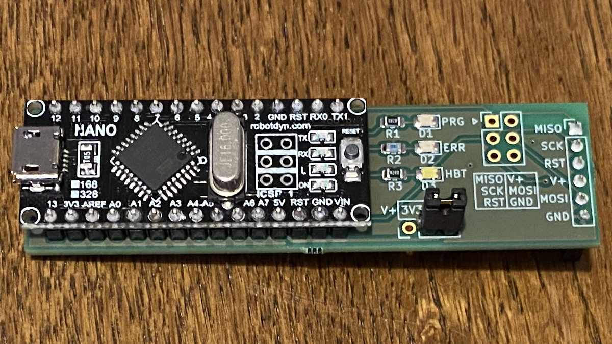
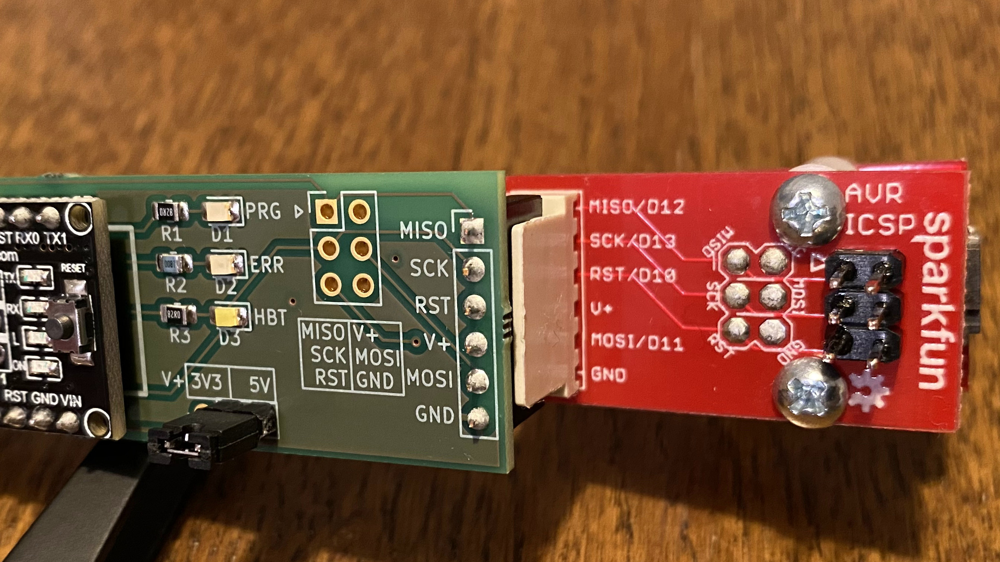
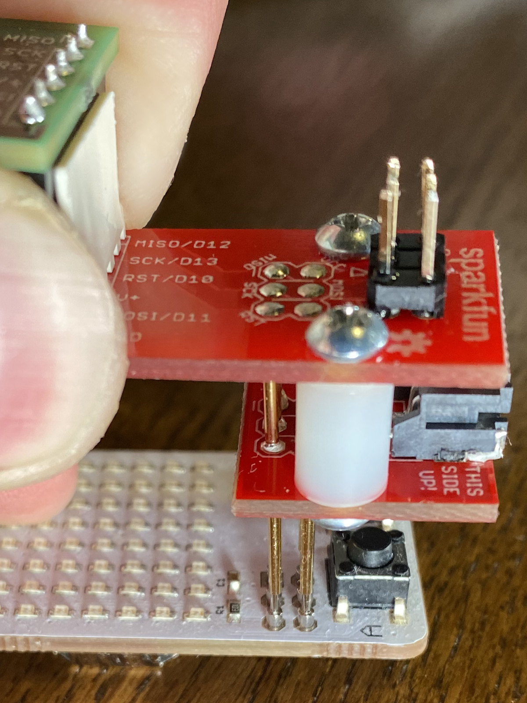
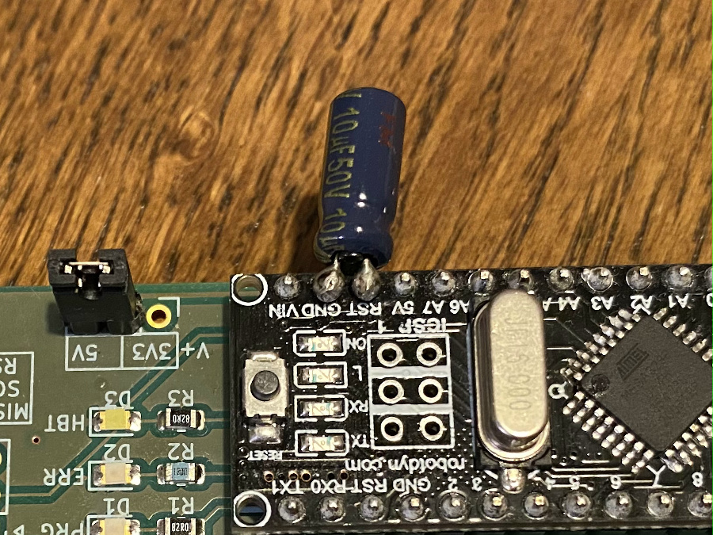

# Arduino Nano as ISP

A simple PCB to use an Arduino Nano as ISP.

The board has the "standard" ICSP header, as well as a 01x06/2.54mm header with the same pinout as the SparkFun adapter (see below). There is a header for a jumper which allows you to connect the V+ pin either to 5V or 3.3V (or to disconnect it). Beware that the data pins will be 5V nonetheless!

The other connections are as follows:
- D7 -> LED1
- D8 -> LED2
- D9 -> LED3
- D10 -> RESET
- D11 -> MOSI
- D12 -> MISO
- D13 -> SCK

This means you can use the ArduinoISP sketch from the built-in examples unchanged.

The SMD components are 0805 (2012 metric) with somehow bigger pads to allow for hand soldering. The LED are optional though, the board will work equally well without them. I use this [Arduino Nano clone](https://s.click.aliexpress.com/e/_Af7AwF) from RobotDyn, but any compatible board will do.

I designed this because I wanted something easy (and relatively inexpensive) to use in combination with the [SparkFun ISP Pogo Adapter
](https://www.sparkfun.com/products/11591).

I use it i.a. to program my [KeyChainino](https://www.keychainino.com/):

### Capacitor between RST and GND
In order to be able to flash the Arduino bootloader to the [Lora Button board](https://github.com/crox-net/lora-button-example), I had to add a 10uF capacitor between the RST and GND pins:

This is documented i.a. here: [ArduinoISP / how to wire your boards](https://www.arduino.cc/en/Tutorial/BuiltInExamples/ArduinoISP#how-to-wire-your-boards).

A future revision of the board will likely include that option :-)

