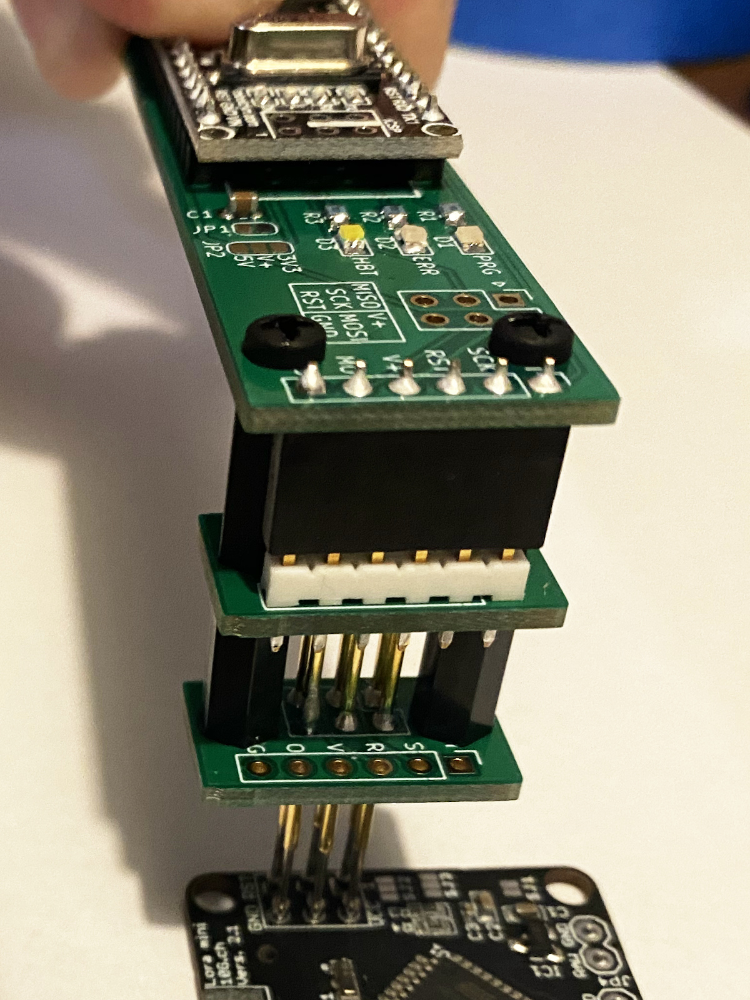

# Arduino Nano as ISP

A simple PCB to use an Arduino Nano as ISP, together with a "pogo pins" adapter.

The board has the "standard" ICSP header, as well as a 01x06/2.54mm header with the same pinout as the SparkFun adapter (see below). The latest revision of the board also includes its own pogo pins adapter, that can be used instead of the SparkFun one and that is secured to the main PBC with screws, making the setup more compact and stable. The first version had a header for a jumper which allowed you to connect the V+ pin either to 5V or 3.3V, this has now been replaced by a solder joint which connects V+ to 5V by default (you need to cut the small trace between the two corresponding pads of the JP2 solder joint if you don't want this). Beware that the data pins will be 5V in any case!

The other connections are as follows:
- D7 -> LED1
- D8 -> LED2
- D9 -> LED3
- D10 -> RESET
- D11 -> MOSI
- D12 -> MISO
- D13 -> SCK

The version 1.1 also adds C1, a 10uF capacitor between the RST and GND pins of the Arduino Nano (see below). It can be disabled by cutting the trace between the two pads of the JP1 solder joint.

As of Arduino 1.8.13, you can use the ArduinoISP sketch from the built-in examples unchanged. Unless C1 is disabled, you need to press "reset" on the Arduino Nano shortly before clicking "Upload" in the Arduino IDE for the sketch to upload successfully.

The SMD components are 0805 (2012 metric) with somehow bigger pads to allow for hand soldering. The LED are optional though, the board will work equally well without them. I use this [Arduino Nano clone](https://s.click.aliexpress.com/e/_Af7AwF) from RobotDyn, but any compatible board will do.

 

### First published version

Initially, I designed this because I wanted something easy (and relatively inexpensive) to use in combination with the [SparkFun ISP Pogo Adapter](https://www.sparkfun.com/products/11591).

I use it i.a. to program my [KeyChainino](https://www.keychainino.com/):

### Capacitor between RST and GND
In order to be able to flash the Arduino bootloader to the [Lora Button board](https://github.com/crox-net/lora-button-example), I had to add a 10uF capacitor between the RST and GND pins:

This is documented i.a. here: [ArduinoISP / how to wire your boards](https://www.arduino.cc/en/Tutorial/BuiltInExamples/ArduinoISP#how-to-wire-your-boards).

The current revision of the board includes the footprint for such a capacitor (C1).

